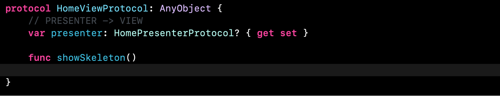

# Ejemplo aplicación arquitectura VIPER

Esta pequeña app es un simple ejemplo de la aplicación de la arquitectura de código VIPER, la app tiene una funcionalidad bastante simple, hace una llamada a un servidor y muestra los datos recibidos en una vista de tabla, al seleccionar una de las celdas de esta vista de tabla la app navega a una vista detalle que muestra todo el contenido del texto de la celda seleccionada. La app tiene dos módulos de VIPER uno para la “Home” y otro para la “Vista detalle”. Este proyecto ha sido construido enteramente por código sin el uso de storyboards.  Abajo cuento un poco de la construcción del proyecto y como he ido implementando la arquitectura.

## ScreenShots:

Home Loading View             |  HomeView                 | Detail View 
:-------------------------:|:-------------------------:|:-------------------------:
  |   |

## Setup inicial (eliminando el storyboard y redireccionando entrada de la app al router del primer módulo de VIPER)

El primer paso seria eliminar el archivo "storyboard" y cambiar los archivos “plist” eliminando el punto de entrada de la app que antes se llamaba “main”, lo que haremos ahora es crear nuestra propia ventana de entrada en el SceneDelegate. Como en VIPER la navegación se hace por medio del router presente en cada módulo deberemos redireccionar nuestro punto de entrada de la aplicación al router de nuestro primer módulo de VIPER. En esta app el primer módulo se llama “Home” y en su router tenemos un método responsable por crear y hacer el setup de todo el módulo de VIPER, en el SceneDelegate llamamos esta función del router que en este caso nos devuelve un navigation controller y lo ponemos como punto de entrada en nuestra app que nos dirigirá a la primera pantalla “HomeView” y así ya hemos sustituido completamente el storyboard y implementado nuestro primer módulo de VIPER. Imagen (0)

(0)

## Router en VIPER

Tras sustituir el storyboard de la app el responsable por la navegación pasa a ser el router de cada módulo. Esta tarea de navegación en otras arquitecturas se veía acumulada dentro de los ViewController que estaban íntimamente ligados a los seguintes ViewControllers del Flow de la applicacion, en VIPER tenemos el router que adopta una sola funcionalidad (navegación) dentro de nuestra app, acercándonos a un código más limpio, más independiente y que implementa el principio de single responsability. Como podemos ver en la imagen (1) el router es responsable por crear y inyectar las propiedades de cada clase de nuestro módulo de VIPER por medio de una función estática llamada “createHomeModule()” que será siempre la puerta de entrada a de cualquier módulo.

(1)

## Comunicación entre clases de VIPER mediada por protocolos

Si nos fijamos en la imagen (1) arriba hemos inicializado todas las clases de VIPER, cada una se “conforma” con sus correspondientes protocolos y por este motivo a continuación hemos podido con facilidad acceder e inyectar como propiedades las instancias de las diferentes clases entre ellas para permitir la debida comunicación. En la imagen (2) tenemos todos los protocolos creados para permitir la comunicación entre las clases y definir las propiedades y métodos que deben implementarse de manera inicial en todas las clases. Luego en cuanto empecemos a implementar diferentes funcionalidades en nuestra app iremos añadiendo métodos a los correspondientes protocolos.

(2)

## La vista en VIPER

Como antes dicho la arquitectura VIPER segrega completamente la funcionalidad de cada pieza buscando aplicar el principio de single responsability, por lo tanto la vista tiene la única función de mostrar elementos visuales y enviar interacciones del usuario al presenter, diferente de otros patrones de arquitectura en VIPER toda la lógica de controle de elementos de la vista se encuentra en el presenter “ya hablaremos a cerca de el en futuro”, la vista no debe contener ninguna lógica y solo debe comunicarse con el presenter. En el caso de esta simple app lo único que hice en esta vista inicial “HomeView” imagen (3) ha sido crear una vista de tabla y registrar a ella una celda custom creada a parte también de manera programática imagen (4). Podemos percibir también que la vista de tabla y su celda custom está ya configuradas para usar la librería de “SkeletonView”.

(3)

(4)

## El presenter en VIPER

El presenter es la pieza que se comunica con la vista y contiene toda su lógica, el presenter es informado de interacciones del usuario por medio de la vista y decide que acciones tomar, en caso de tener que navegar a otra pantalla pasa la acción al router que se encarga de navegar a la siguiente pantalla, en caso de tener que realizar una llamada al servidor se comunica con el interactor “lo veremos en detalle en el futuro” para pedir y recibir estos datos y luego poder informar a la vista que tiene que mostrarlos en pantalla. A este punto del desarrollo de esta simple aplicación lo único que he puesto en el presenter es un método en el “viewDidLoad” para mostrar en la vista nuestro “skeletonView” cuando se inicie la app. Para implementar cualquier funcionalidad por la más simple que sea el Flow es el mismo, por eso describiré ahora el proceso una única vez y para las demás implementaciones ya seria repetir este mismo patrón. Lo primero seria irnos al archivo donde tenemos todos los protocolos y añadir el método que queremos realizar, como queremos que esta acción pase del presenter para la vista añadimos el método en el protocolo “HomeViewProtocol” imagen (5), en seguida nos vamos a la “HomeView” que es la que “conforma” a este protocolo e implementamos el método imagen (6), y por último llamamos el método en presenter imagen(7).

(5)

(6)

(7)

## El interactor en VIPER

La función del interactor es ser responsable por la lógica de nuestra aplicación, se comunica con la base de datos local, el servidor, con los modelos de datos y recibe “ordenes” del presenter. Para esta app estaremos implementando una funcionalidad que consiste que cuando el usuario inicie al aplicación lo que haremos es hacer un “request” a un servidor abierto llamado “jsonPlaceholder” que nos devolverá un json con algunos datos genéricos que serán presentados en una vista de tabla. El flujo que va a seguir la app es primero pasar por el router de la primera vista que inicializara todo el módulo y cargará la vista “Home”, al cargarse la vista home el presenter será informado y pedirá al interactor que haga una llamada al servidor, el interactor se comunicará con la capa de conexión externa que devolverá estos datos al interactor, el interactor puede hacer la modificaciones necesarias en los datos recibidos y devolverlos al presenter listos para presentar, el presenter a su vez comunicará a la vista que enseñe los datos recibidos en la vista de tabla. (Como mostrar este flujo en funcionamiento con imágenes tomaría mucho espacio decidí no incluirlo en este documento, recomiendo mirarlo directamente en el proyecto).

## Entity en VIPER

Contiene únicamente modelos de datos y el único que se comunica con ello es el interactor, en esta app el único entity es esta simple estructura de datos imagen (8) que utilizaremos para serializar nuestro archivo JSON recibido del servidor.

(8)

## Otras clases y ciclos de retención en VIPER

En esta arquitectura cada módulo debe contener como mínimo una vista, interactor, presenter, entity y router, pero si en el módulo tenemos más necesidades como pueden ser una clase para conexión externa con servidor o una clase para gestionar la memoria local las podemos crear juntamente con sus protocolos para permitir su comunicación con el interactor. Es importante también destacar que en la “jerarquía” de VIPER la vista “domina” el presenter que a su vez domina el router y el interactor, las clases dominadas a su vez también poseen una referencia a la clase dominadora, esta referencia a la clase dominadora debe siempre ser una referencia débil (weak reference) para no generar ciclos de retención y así optimizar el uso de la memoria por nuestra app.

